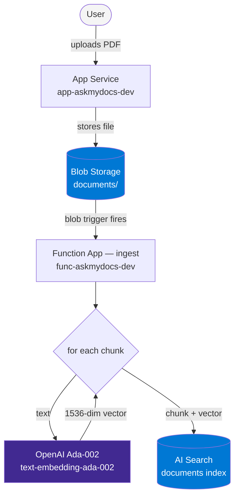
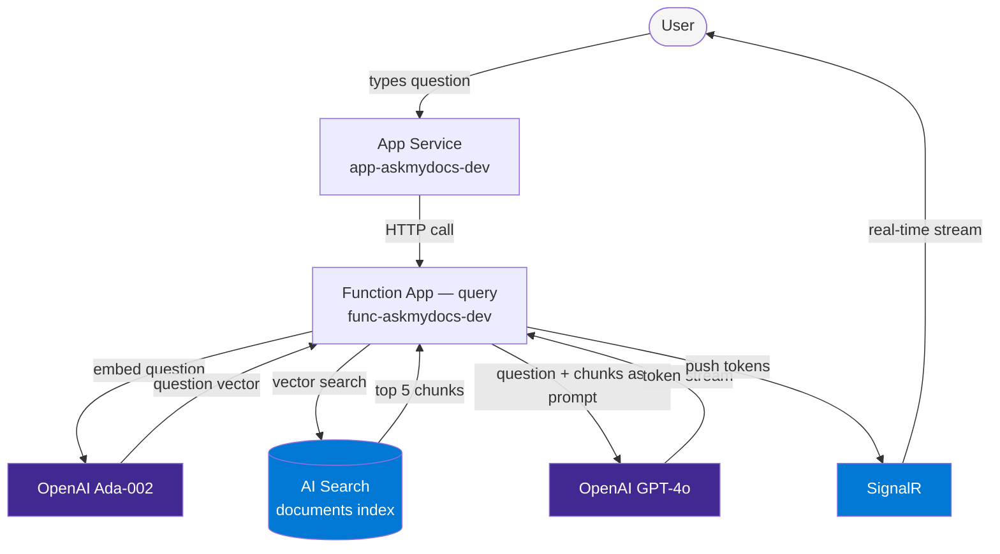
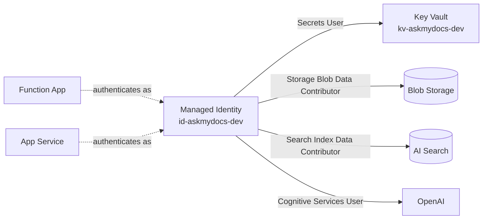

# Architecture

## Ingestion Flow

When a user uploads a PDF, it kicks off an automated pipeline that processes the document and makes it searchable.

**Steps:**
1. User uploads PDF via the Next.js UI
2. App Service writes the file to Blob Storage (`documents` container)
3. The blob trigger fires automatically — Function App starts ingesting within seconds
4. Function splits the PDF into overlapping chunks (~500 tokens each with overlap)
5. Each chunk is sent to Ada-002, which returns a 1536-dimensional vector
6. Chunk text + vector are pushed to the AI Search index together

---

## Query Flow

When a user asks a question, the app finds the most relevant chunks and streams a grounded answer.

**Steps:**
1. User types a question in the chat UI
2. App Service forwards it to the query Function App via HTTP
3. Function embeds the question using Ada-002 (same model as ingestion)
4. AI Search finds the 5 chunks whose vectors are closest to the question vector
5. Function builds a prompt: system instructions + retrieved chunks + question
6. GPT-4o streams the answer back token by token
7. Each token is pushed to the browser via SignalR — the user sees the answer appear live

---

## Identity & Secrets

No passwords exist anywhere in the application code or config.

Both the Function App and App Service are assigned `id-askmydocs-dev`. When either service needs to talk to Blob Storage, Key Vault, AI Search, or OpenAI, Azure checks the identity's role assignments — no keys or passwords required.

---

## Observability

All services report to the same App Insights instance, which stores data in the shared Log Analytics workspace.

| What | Where |
|---|---|
| Function App logs + traces | `appi-askmydocs-dev` |
| App Service request logs | `appi-askmydocs-dev` |
| All raw data | `log-askmydocs-dev` (Log Analytics) |
| Query language | KQL (Kusto Query Language) |
